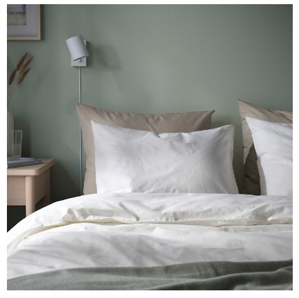

# 枕参考
1.	名称：**SANDGRÄSMAL サンドグレースマル**
- https://www.ikea.com/jp/ja/p/sandgraesmal-pillow-00544879/
- サイズ：50x60 cm
- 値段：　399円
- 重量：435 g
 
 

### 枕カバー(IKEA)
- https://www.ikea.com/jp/ja/p/dvala-pillowcase-white-00357245/
- **DVALA ドヴァーラ**
- サイズ：50x60 cm
- 値段：　799円 /2枚
- 

 

2.	名称：**Sテルスタイル枕(Nホテル3 スタンダード)**
- https://www.nitori-net.jp/ec/product/7550721s/?rc=set
- サイズ：幅40×奥行60×高さ20cm
- 値段：　1,990円
- 重量：　約1kg

 

3.	名称：**マシュマロタッチ　ふんわりもっちり枕(P2209)**
- https://www.nitori-net.jp/ec/product/7550721s/?rc=set
- サイズ：幅60×奥行40×高さ19cm
- 値段：　1,290円
- 重量：　約780g

 

4.	名称：**洗えるポリエステル枕(NF HI)**
- https://www.nitori-net.jp/ec/product/7550714s/?rc=set
- サイズ：幅40×奥行60×高さ13cm
- 値段：　799円
- 重量：　約620g

 

### 枕カバー(ニトリ)
- https://www.nitori-net.jp/ec/product/7518001s/?rc=set
- **枕カバー まち付きタイプ　標準(Nホテルスタイル2 プレーン)**
- サイズ：幅42×奥行61×高さ3cm
- 値段：　799円 /1枚
![画像]（枕カバー_NITORI.jpg）

5. 名称：**日本製 そばがら枕 柄はおまかせ (ブルー系)**
- https://www.amazon.co.jp/%E6%97%A5%E6%9C%AC%E8%A3%BD-30%C3%9745cm-%E3%81%9D%E3%81%B0%E3%81%8C%E3%82%89%E6%9E%95-%E6%9F%84%E3%81%AF%E3%81%8A%E3%81%BE%E3%81%8B%E3%81%9B-%E3%83%96%E3%83%AB%E3%83%BC%E7%B3%BB/dp/B07P76GV6R/ref=asc_df_B07P76GV6R/?tag=jpgo-22&linkCode=df0&hvadid=549664056162&hvpos=&hvnetw=g&hvrand=13695647838553047208&hvpone=&hvptwo=&hvqmt=&hvdev=c&hvdvcmdl=&hvlocint=&hvlocphy=1009293&hvtargid=pla-1489100739727&psc=1
- サイズ：30×40cm(側サイズ30×45㎝)  
- 値段：　1,390円 
- 重量：　 
（日本の枕_1.jpg）

